# *Hello*, GoPiGO3

<blockquote><a rel="cc:attributionURL" property="dct:title" href="https://github.com/Albert-Alvarez/ros-con-gopigo3">Hello, GoPiGO3</a> por <a rel="cc:attributionURL dct:creator" property="cc:attributionName" href="https://thealbert.dev/">Albert Álvarez Carulla</a> se distribuye bajo una <a rel="license" href="https://creativecommons.org/licenses/by-nd/4.0/deed.es">Licencia Creative Commons Atribución-SinDerivadas 4.0 Internacional (CC BY-ND 4.0)</a>.<br /></a></blockquote>

En esta sesión vamos a aprender las operaciones básicas para interactuar con el robot y poder hacer con él las operaciones básicas. Básicamente, nos dedicaremos a ver cómo conectarnos a la Raspberry Pi (RPi) para poder programar nuestros nodos en *Robot Operating System* (ROS), instalar *packages*, ejecutar los nodos; cómo hacer que el robot se mu

## Contenidos

- [Introducción](#hello-gopigo3)
- [Objetivos](#objetivos)
- [Procedimiento](#procedimiento)
- [Reto](#reto)
- [Evaluación](#evaluación)
- [Conclusiones](#conclusiones)

## Objetivos

- Conectarnos mediante SSH a la RPi.

- Conocer las instrucciones para que el robot se mueva.

- Instalar *packages* en un *workspace* de ROS.

- Programar nodos de ROS en python.

- Obtener los datos del LIDAR y visualizarlos en Rviz en nuestro PC.

- Obtener las imágenes de la cámara y visualizarlas en Rviz en nuestro PC.

## Procedimiento

> **IMPORTANTE:** Cualquier **duda** o problema durante esta sesión (¡o cualquier cosa que haya que corregir en el guión!), **cread un *issue* en el siguiente [enlace](https://github.com/Albert-Alvarez/ros-con-gopigo3/issues)**. Deberéis de **crearos un usuario en [GitHub](https://github.com/)** [](../assets/imgs/its_free.jpg) La idea es que todo quede centralizado aquí y futuros estudiantes encuentren aquí las dudas y soluciones que han tenido compañeros de cursos anteriores. Esto no se puede hacer en Moodle tal y como está configurado ahora mismo puesto que los mensajes del Foro no sobreviven de un año para el otro 😥

### Configuración del PC

Cuando hablamos del PC, hablamos de tu ordenador de sobremesa o portátil. En él tenemos instalada una máquina virtual (VM) con Ubuntu 18.04 LTS (Bionic), a no ser que tengas directamente un PC con este Sistema Operativo (OS). En la VM, también tenemos instalado ROS Melodic; la versión *desktop-full*. Este es nuestro punto de partida. Si esto no lo tienes, ¡no se qué haces aquí leyendo que no lo estás instalando todo! 😭

Partiendo de esta base, vamos a instalar [Visual Studio Code](https://code.visualstudio.com/) (VSC) para poder programar remotamente nuestra RPis de una manera mucho más sencilla. Para ello, ejecutamos el siguiente comando en el terminal:

```bash
sudo snap install --classic code
```

Una vez finalizada la instalación, tendremos la aplicación disponible desde el menú de aplicaciones o bien escribiendo el comando `code` en el terminal.

> **Es altamente recomendable que os acostumbréis a moveros por el terminal** más que por el entorno gráfico. Habrá situaciones en las que no dispondréis de entornos gráficos (servidores, sistemas embebidos, ...) y solo podréis tirar de terminal. Además, es mucho más rápido moverte con ella a través del sistema de ficheros y muchas operaciones solo se pueden realizar desde allí. Al principio puede parecer complicado (intimidante, más bien), pero en dos días veréis que solo se necesitan un par de comandos para hacer las operaciones del día a día y en un futuro os acordaréis de mí y diréis "que razón tenía el profe ese... ¿cómo se llamaba?" 😭 Pues eso.

Finalmente, en VSC, instalamos un módulo que nos permitirá conectarnos y trabajar remotamente en la RPi. Este módulo se llama [*Remote Development*](https://marketplace.visualstudio.com/items?itemName=ms-vscode-remote.vscode-remote-extensionpack). Para instalarlo, abrimos VSC y, en la barra lateral izquierda, nos vamos a las extensiones (o con el atajo <kbd>CTRL</kbd>+<kbd>SHIFT</kbd>+<kbd>X</kbd>). En la barra de búsqueda, ponemos "remote development" y, normalmente, suele ser el primer resultado. Al clicar en él, se visualizará en la página principal de VSC la página de la extensión. Clicamos `Install` y *c'est fini*. Ya lo tenemos todo preparado. Falta configurar la conexión remota, pero eso lo haremos cuando nos vayamos a conectar.

<p align="center">
    <a href="../assets/imgs/vsc-remote-development.png">
      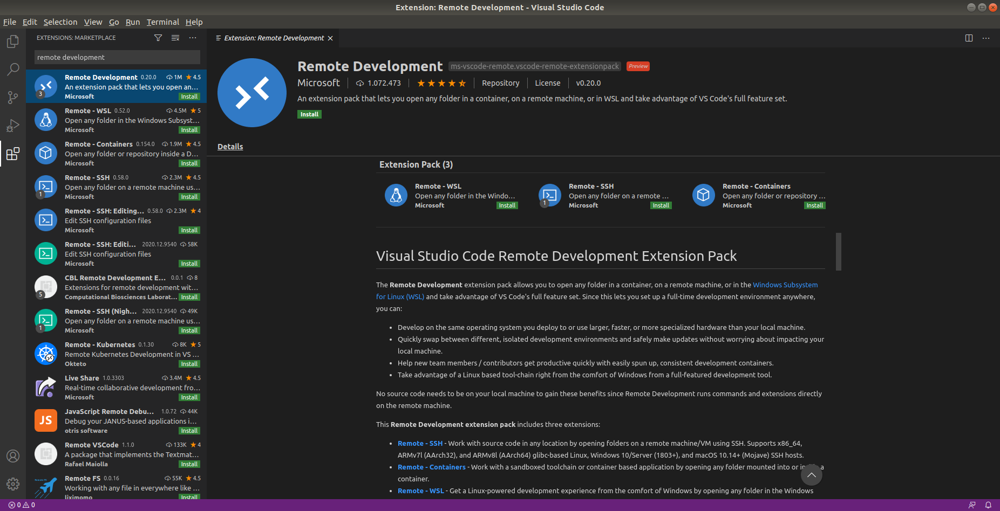
    </a>
</p>

### Encendiendo máquinas

¡Vamos a encender el robot! Eso sí, primeramente nos aseguramos que tengamos todo disponible: RPi, motores, LIDAR, cámara, tarjeta microSD, ... La lista completa está disponible en el [`README` principal](../README.md). Con todo disponible y debidamente conectado, vamos a alimentar la RPi a través de su puerto microUSB utilizando el transformador pertinente. La RPi iniciará su OS y en unos 15~20 segundos se conectará a alguna de las redes WiFi que tiene configuradas por defecto. Algo muy importante es la dirección IP que le da el *router* a la RPi, puesto que la necesitamos para poder conectarnos a ella. Preguntadle a vuestro profesor a qué red WiFi os tenéis que conectar (¡tiene que ser la misma que a la que se haya conectado vuestra RPi!) y qué IP tiene vuestra RPi (entrará en el *router* y os lo dirá).

Ahora vamos a conectarnos a la RPi desde nuestra VM. Nos vamos a VSC y hacemos clic al icono situado en la esquina inferior-izquierda  En la parte superior de la aplicación, se nos abrirá un desplegable. Allí seleccionamos `Remote-SSH: Connect to Host...`. Hecho esto sale una lista con todos los sistemas remotos que tenemos configurados. Obvio. No hemos configurado todavía ninguno y por eso está la lista vacía (cuando tengamos configurado nuestro sistema remoto, solamente deberemos de seleccionarlo en la lista; lo veremos en la siguiente sesión cuando nos tengamos que volver a conectar a la RPi). Clicamos a `+ Add New SSH Host...`.  Seguidamente, nos pide ingresar la instrucción de conexión. Es esta:

```bash
ssh pi@XXX.XXX.XXX.XXX
```

donde `XXX.XXX.XXX.XXX` es la IP de vuestra RPi que os dará vuestro profesor. Una vez ingresada la instrucción, pulsamos <kbd>ENTER</kbd>. En el siguiente desplegable, lo mismo, <kbd>ENTER</kbd>. Ya está todo configurado, ahora vamos a la ventana *pop-up* que nos ha aparecido en la esquina inferior-derecha de la aplicación y le damos a `Connect`.

<p align="center">
    <a href="../assets/imgs/pop-up-connect.png">
      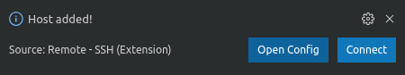
    </a>
</p>

Al hacer esto último, nos aparece un mensaje en la parte superior del tipo

```
"XXX.XXX.XXX.XXX" has fingerprint "SHA256:xxxxxxxxxxxxxxxxxx..."
```

y nos pregunta que si queremos continuar. ¿Queremos continuar? Pues eso, le decimos que `Continue`. Este mensaje solo aparece la primera vez que nos conectamos a un sistema remoto. Por último, ahora ya sí, nos pide la contraseña del usuario de la RPi que es `raspberry`. La ingresamos y pulsamos <kbd>ENTER</kbd>. Se nos abrirá una nueva ventana de VSC que estará trabajando sobre el sistema remoto (podéis/recomiendo cerrar la otra ventana de VSC para ahorrar espacio en el Escritorio). Si es la primera vez que nos conectamos, la aplicación tardará unos segundos en conectarse puesto que está instalando en la RPi las herramientas necesarias para llevar a cabo la comunicación remota. Sabemos que nos hemos conectado correctamente cuando en la esquina inferior-izquierda aparece la IP de nuestro sistema remoto  (en mi caso, `192.168.1.242` en el momento de escribir estas líneas).

> Hasta ahora habéis seguido la chuleta de cómo conectarse remotamente a la RPi. No os he explicado que es SSH. Eso queda como trabajo fuera del aula y os lo preguntaré en personal la siguiente sesión de prácticas 😈

Ahora si abrimos un terminal dentro de VSC, ya sea yendo a `View > Terminal` o mediante el atajo <kbd>CTRL</kbd>+<kbd>`` ` ``</kbd>, vemos que estamos dentro de la RPi; y lo sabemos por el *prompt* del terminal que nos indica el usuario `pi` y el *hostname* del sistema remoto `raspberry`.

<p align="center">
    <a href="../assets/imgs/terminal-remote.png">
      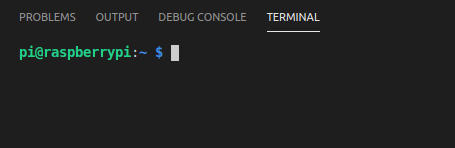
    </a>
</p>

También podemos abrir carpetas en nuestra RPi desde VSC y poder editar así sus contenidos. Para no tener que ir abriendo y cerrando carpetas (que causa que se abra y cierre la ventana de VSC), abriremos directamente nuestra carpeta de usuario y así tendremos acceso a todos nuestros ficheros. Nuestra carpeta de usuario es `/home/pi/`. Para abrirla, vamos al explorador de archivos de la barra lateral izquierda (<kbd>CTRL</kbd>+<kbd>SHIFT</kbd>+<kbd>E</kbd>) y clicamos en `Open Folder`. Se nos abrirá un desplegable con nuestra carpeta de usuario puesta por defecto. Si no lo está, la ponemos. Finalmente, le damos a `Ok`. Si todo ha ido como tenía que ir (básicamente, que no nos hemos saltado ningún paso), deberíamos tener nuestro VSC abierto, con los archivos de nuestra RPi a la izquierda y un terminal dentro de la RPi en la parte de abajo. **¡Todo lo que es la configuración de VSC ya está hecha! *Congrats!!*** 🥳

<p align="center">
    <a href="../assets/imgs/vsc-final.png">
      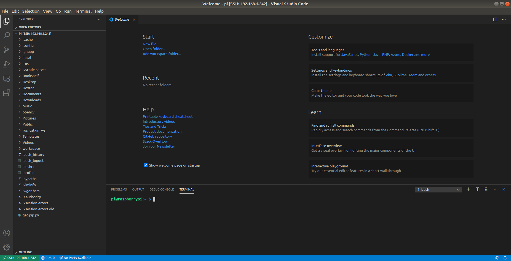
    </a>
</p>

### "¡Está vivooo! ¡Vivoooooo!"

<p align="center">
    
</p>

Ahora emularemos al <a href="https://es.wikipedia.org/wiki/V%C3%ADctor_Frankenstein">Dr. Víctor Frankenstein</a> y daremos vida a nuestro robot haciendo que se mueva. Como Adam, que es como se llamaba realmente la criatura creada por el Dr. Frankenstein (os dejo ese detalle ahí para cuando vayáis a Pasapalabra 🧟‍♂️ (me debéis un porcentaje del bote)), nuestro robot necesita alimentación para funcionar. Así que lo primero que haremos será conectar nuestro pack de pilas al conector jack que hay en la placa de circuito impreso (PCB) roja. De este modo, estaremos alimentando los motores con los 12 V que necesitan. El transformador de la RPi solo da 5 V. Se pueden dejar conectados ambos y es lo más recomendable mientras que está operando con la RPi sin que el robot deba moverse. Así, la RPi se alimenta del transformador y se alarga la carga de las baterías. Cuando tengamos que hacer que el robot se mueva, desconectamos el conector microUSB de la RPi y, al acabar la prueba y volver a coger nuestro robot para programar, volvemos a conectar el microUSB. Fácil.

> **IMPORTANTE:** Aseguraros que siempre esté conectado o bien el pack de baterías o bien la alimentación a través del microUSB, si no, cortaréis la alimentación de la RPi. Esto último, un corte a lo bestia de la alimentación de la RPi sin apagarla debidamente, puede ocasionar que el robot deje de funcionar. ¿Con qué probabilidad? Con la misma de que un *pendrive* os deje de funcionar si no hacéis un "Explusar el dispositivo con seguridad". ¿Os arriesgaréis?

Una vez enchufado, sabréis que todo esta correcto cuando el LED de la PCB roja está en color verde.

#### Organización del espacio de trabajo

Entramos en un tema personal, pero que os obligaré a seguir con mano de hierro. La palabra mágica es "OR-GA-NI-ZA-CIÓN". Si yo entro a un ordenador y quiero buscar las fotos de un prototipo, ¿iré a buscarlas a la carpeta "Imágenes" o en la carpeta "test-borrar"? O si quiero buscar un esquemático de una PCB, ¿iré a buscarla a la carpeta "Proyectos/PCB" o a la carpeta "Escritorio/Ordenar_2014_12_06/placa1"? Como en los ejemplos anteriores, cada uno puede guardar las cosas donde quiera y "no hay problema", pero es recomendable que utilicéis un sistema de organización que os permita tener vuestro espacio de trabajo ordenado. En este caso, aplicar este criterio de organización hará que pueda encontrar vuestro archivos más fácilmente (no se puede evaluar lo que no se puede encontrar... [](../assets/imgs/if-u-know-what-i-mean.jpg)). Por ello, a modo [Emperador Palpatine](https://starwars.fandom.com/es/wiki/Darth_Sidious), utilizaremos mi criterio para organizarnos. Simplemente, crearemos la siguiente estructura de directorios en vuestra carpeta `home`. 

```
/home/pi
└── workspace
    └── python
    └── ros
```

Básicamente, tendremos una carpeta llama `workspace` en vuestro `home` donde dentro habrá una carpeta para cada tipo de proyectos. Para que tengáis un ejemplo, yo tengo esta estructura de directorios en mi PC.

```
/home/albert
└── workspace
    ├── SPB_Data
    ├── arduino
    ├── electronjs
    ├── kicad
    ├── labview
    ├── ltspice
    ├── matlab
    ├── pcb
    ├── robodk
    ├── stm32cubeide
    ├── vm-shared-folder
    └── www
```

Y en cada carpeta tengo los diferentes tipos de proyecto. ¿Quiere decir que esta es la mejor forma de organizarse? Rotundamente, no. Pero es una forma y lo importante es que sigamos todos una forma en común. En nuestro caso, además, solo tendremos dos tipos de proyectos: del tipo ROS y python. Por ello, solo tenemos dos carpetas debajo del `workspace` llamadas `python` y `ros`. Allí crearemos nuestros **proyectos ROS** o, como **se suelen llamar, *workspaces*** de ROS.

Esta misma organización debe de seguirse tanto en RPi como en vuestra VM.

"Vale, vale, seré organizado y tal. ¿Cómo creo las carpetas?". Pues lo haremos con el terminal. Nos vamos al terminal de VSC (terminal que está corriendo dentro de la RPi) y utilizamos el comando `mkdir` para crear una carpeta (`mkdir` = *make directory* ). El comando es

```bash
mkdir ~/workspace
```

La tilde `~` es un carácter especial que, al ejecutarse el comando, es sutituido por el *path* de vuestro `home` (que es `/home/pi/`). De este modo, el comando se ejecuta como 

```bash
mkdir /home/pi/workspace
```

Este carácter lo veréis por doquier. Si no ponemos la tile o ningún *path* delante del nombre de la carpeta que queremos crear, la carpeta se creará en la carpeta en la que se encuentre en ese momento el terminal. Podemos saber en qué carpeta estamos con el comando `pwd`.

<p align="center">
    <a href="../assets/imgs/pwd.png">
      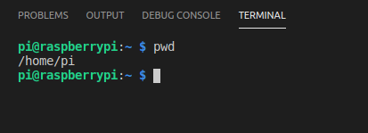
    </a>
</p>

En el ejemplo, ya estábamos en la carpeta de nuestro `home`, por lo que podíamos haber utilizado directamente `mkdir workspace`.

Ahora entremos en la carpeta `workspace`. Lo hacemos con el comando `cd` (`cd` = *change directory*).

```bash
cd workspace
```

Si ahora ejecutamos el comando `pwd`, vemos que estamos en la carpeta `/home/pi/workspace/`. También podemos ver dónde estamos directamente en el *prompt* del terminal.

<p align="center">
    <a href="../assets/imgs/prompt-path.png">
      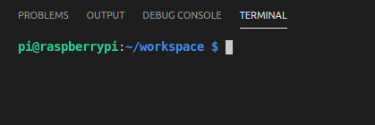
    </a>
</p>

Perfecto. Os dejo para vosotros crear dentro de la carpeta `workspace` una carpeta llamada `ros` y otra llamada `python` (¡respetad las mayúsculas y minúsculas durante todas las sesiones!). Finalmente, entrad en la carpeta `python`.

> Con el comando `cd` pasa lo mismo que con `mkdir`. Si no ponéis un [*path* entero o absoluto](https://es.wikipedia.org/wiki/Ruta_(inform%C3%A1tica)#Ruta_absoluta) (que es como se dice correctamente), el comando intentará entrar a una carpeta que se llame como le habéis indicado y que esté dentro de la carpeta en la que os encontráis. Este tipo de *path* se les conoce como [*path* relativo](https://es.wikipedia.org/wiki/Ruta_(inform%C3%A1tica)#Ruta_relativa).

#### Mover el robot con python

Empecemos todos desde el mismo lugar. Dentro de la RPi (terminal VSC), estamos en la carpeta `~/workspace/python/`. Allí crearemos una carpeta para un proyecto llamado `move_motors`. Después entramos en esa carpeta.

Como veis, es recomendable no poner a los archivos/carpetas espacios en blanco ni caracteres no ingleses como "Ñ" , "Ç" o acentos. A muchos programas no les gusta, como seguramente habéis podido comprobar todos aquellos que guardáis las cosas del grado en una carpeta llamada `Grau d'Enginyeria Biomèdica`.

Ahora vamos crear en esa carpeta un archivo con el mismo nombre y con extensión `.py`. Es decir, un archivo python. Esto lo hacemos desde el explorador de archivos de VSC, no del terminal.

<p align="center">
    <a href="../assets/imgs/move_motors.png">
      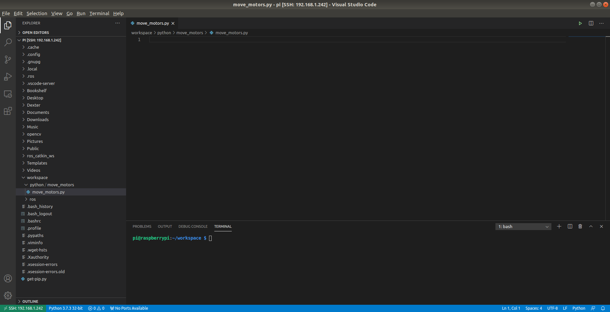
    </a>
</p>

> Si no os aparecen las carpetas creadas en el explorador de archivos de VSC, dadle al icono de refrescar situado justo encima 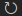

Hacemos clic derecho a la carpeta `workspace/python/move_motors/` y clicamos en `New File`.  Ponemos como nombre `move_motors.py` y automáticamente se nos abrirá un archivo en blanco donde programaremos. También os aparecerá la primera vez una ventana *pop-up* recomendándoos que instaléis un módulo de python. Decidle que sí, así os hará un *highlight* de la sintaxis de python (colores) y será más fácil programar.

¡Muy bien! Vamos a ello. Haremos un pequeño programa para mover los motores hacia adelante 2 segundos y luego pare. El código es el siguiente y en él directamente os comento qué hace cada cosa.

> **IMPORTANTE:** Puede ser tentador copiar/pegar el código. No se puede comprobar (o sí... 😈) si lo habéis hecho o no, ni tampoco se puede obligar. Pero es altamente recomendable que siempre intentéis escribir todo aquello que programéis. Solo así entenderéis qué estáis haciendo. Ahora empezamos suave/fácil, pero más adelante la cosa se complicará y echaréis de menos no haberlo hecho así desde el principio. Es una recomendación para vuestro propio interés 😉

```python
# Importamos las liberias del robot.
from easygopigo3 import EasyGoPiGo3

# Importamos la libreria time para hacer delays.
import time


# Creamos un objeto de la clase EasyGoPiGo3. Este objeto tendra disponible
# todos los metodos y propiedades del robot.
gpg = EasyGoPiGo3()

# Creamos una variable para almacenar la velocidad a la que queremos que se
# mueva nuestro robot.
speed = 400

# Creamos una variable para almacenar el tiempo de la pausa.
seconds = 2

# Fijamos la velocidad del robot.
gpg.set_speed(speed)

# Movemos el robot hacia adelante.
gpg.forward()

# Hacemos una pausa de 2 segundos durante la cual el robot ira hacia adelante.
time.sleep(seconds)

# Paramos los motores.
gpg.stop()
```

De normal, no sería necesario comentar tanto el código puesto que el nombre de las variables y el nombre de los métodos son auto-descriptivos (de ahí la necesidad de que no llamemos a las variables `x` o `n`... 😑), pero como son nuestras primeras líneas con el robot, nos lo perdonamos.

> No os confundáis, debéis de comentar esas porciones de código que necesitan ser explicadas por ser más difíciles de comprender, pero si utilizáis nombres descriptivos para variables y funciones, esas porciones de código a explicar serán menos.

Pues ahora tocaría ejecutar este programa. Primero, obvio, guardamos el archivo. Segundo, debemos de hacer que el archivo se pueda ejecutar. Por defecto, por razones de seguridad, Linux deshabilita la ejecución de los archivos. Vamos a ver cómo habilitarlo.

##### Permisos en Linux

Existe un comando que lista todos los archivos en una carpeta. Ese comando es `ls` (`ls` = *list files/directories*). Vamos a ejecutarlo en la RPi (terminal en VSC) dentro de la carpeta `~/workspace/python/move_motors`.

<p align="center">
    <a href="../assets/imgs/ls.png">
      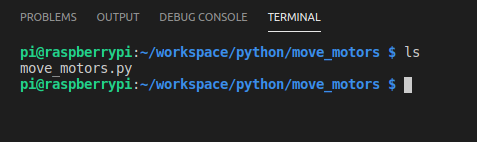
    </a>
</p>

Como vemos, solo se nos lista el único archivo que existe, que es `move_motors.py`. Ahora ejecutaremos el mismo comando, añadiendo el parámetro o *switch* `-l`. Es decir, `ls -l`.

<p align="center">
    <a href="../assets/imgs/ls-l.png">
      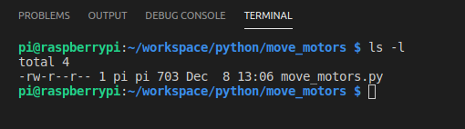
    </a>
</p>

Ahora el comando nos sigue dando un listado de los archivos, pero además adjunta una serie de datos referentes a cada uno de los archivos. Vamos por partes.

Cada fila del listado corresponde a un archivo. En total, hay ocho columnas separadas por un espacio o tabulación.

- La primera columna es el primer guion que aparece en la fila. Ese guion indica que se trata de un archivo. Si fuera un directorio, habría una `d`. Y si fuera un enlace (lo más parecido, sin ser lo mismo, serían los accesos directos en Windows), habría una `l`.
- La segunda columna son los 6 caracteres siguientes. Esos caracteres toman los valores de `-` (*none*), `r` (*read*), `w` (*write*) y `x` (*execute*). Esta columna muestra los permisos para el usuario y grupo propietarios del archivo/directorio y los permisos para el resto de usuarios.
  Los primeros tres caracteres indican los permisos del usuario propietario del archivo. Así pues, si el usuario propietario tiene permisos de solo lectura, los tres primeros caracteres serían `r--`. Si tuviese solo permisos de escritura, serían `-w-`. Si tuviera solo permisos de ejecución, sería `--x`. Los permisos también pueden ser combinados, de tal modo que si el usuario propietario tuviera todos los permisos, sería `rwx`.
  Los tres siguientes caracteres siguen la misma lógica y se refieren a los permisos del grupo propietario del archivo/directorio. 
  Los últimos tres caracteres son los permisos del resto de usuarios.
  Tomando el ejemplo de la captura, los permisos del archivo `move_motors.py` son:
  - Usuario propietario: Lectura (Sí), Escritura (Sí), Ejecución (No).
  - Grupo propietario: Lectura (Sí), Escritura (No), Ejecución (No).
  - Resto de usuarios: Lectura (Sí), Escritura (No), Ejecución (No).
- La siguiente columna es el número de *hard links* al archivo. Nada que nos interese.
- La cuarta columna es el tamaño del archivo en bytes.
- La quinta columna es el usuario propietario. En el ejemplo, somos nosotros, el usuario `pi`, puesto que hemos creado nosotros el archivo.
- La sexta columna es el grupo propietario. En el ejemplo, el grupo es `pi`. Ojo, hay un grupo que se llama `pi`. Este `pi` no es el usuario, sino el grupo.
- La penúltima columna es la fecha de modificación del archivo.
- Por último, aparece el nombre del archivo/directorio.

Ahora que ya conocemos un poco la magia negra que hay detrás de Linux, vamos a ver cómo darnos permisos para ejecutar el archivo `move_motors.py` puesto que hemos visto que no tenemos permisos de ejecución. Para ello utilizamos el comando `chmod` (`chmod` = *change mode*). Utilizaríamos el comando del siguiente modo

```bash
sudo chmod u=r+w+x move_motors.py
```

Vamos a desengranar el comando. Primeramente, con `sudo` ejecutamos el comando con permisos de administrador. Suele ser común utilizar permisos de administrador para configurar los permisos. En este caso no nos haría falta puesto que somos el usuario propietario del archivo y tenemos permisos para modificarlo, pero ante la duda, usad `sudo` cuando cambiéis permisos.

> No es una buena práctica lo que os acabo de decir, pero suele ser común acabar haciéndolo así. Lo que nunca debéis de hacer es dar permisos a todo el mundo porque sí. ¡Eso sí es una mala práctica que se castiga con cadena perpetua! 

Luego utilizamos el comando `chmod` que acompañamos con los permisos que queremos configurar. En este caso, decimos que el *user* propietario tenga permisos de lectura, escritura y ejecución. Es decir, `u=r+w+x` (`u` de *user*, para los despistados) . Si fuéramos a dar permisos al grupo, sería `g=r+w+x` (`g` = *group*). Y si fuéramos a dar permisos al resto de usuarios, haríamos `o=r+w+x` (`o` = *others*). Existe otro modo para no explicitar los tres tipos de permisos. Sería con el comando

```bash
sudo chmod u+x move_motors.py
```

Con esta instrucción (fijaros que hemos cambiado el `=` por un `+`) estamos dando permisos de ejecución al usuario propietario sin modificar los permisos de lectura y escritura del archivo/directorio.

Con esto, ya tenemos permisos para ejecutar el archivo.

##### Ejecutar archivo python

¿Podemos ejecutarlo ya? Sí, pero si lo hacemos, el robot, que justamente lo tenemos al borde de la mesa, empezará a moverse y caerá al suelo. Eso supondría romper el robot y suspender la asignatura. ¡No queremos eso! Levantad el robot de tal manera que, cuando giren las ruedas, el robot no se mueva. Podéis poner un objeto debajo del robot para ello.

...

¿¡Estáis esperando que os diga qué objeto!? Cualquier cosa que tengáis al lado, mujeeer/hombreee. ¡Haced un poco de Bear Grylls y sobrevivid!

<p align="center">
    <a href="../assets/imgs/Bear-Grylls.jpg">
      
    </a>
</p>
Una vez tengáis asegurado el robot, hacemos en el terminal de la RPi

```bash
python move_motors.py
```

Después de este comando, vuestro robot debe de haber movido sus ruedas hacia adelante durante 2 segundos hasta detenerlas. Si no ha sido el caso, revisa la alimentación del robot, el código de tu archivo python y sus permisos. Si aún así no te arranca, ¡nos avisas!

##### Otras instrucciones

La librería EasyGoPiGo3 ofrece otra serie de métodos adicionales para mover el robot. Todos esos métodos los podéis encontrar [aquí](https://gopigo3.readthedocs.io/en/master/api-basic/easygopigo3.html#easygopigo3). Más adelante podéis necesitarlos.

### ROS en la RPi

Parece que llevemos un buen rato (y así es), pero solo hemos hecho que se mueva el robot hacia adelante 2 segundos. *Not bad*, pero vamos a ir un poco más allá utilizando esta vez ROS. Vamos a hacer exactamente el mismo ejercicio que antes, pero mediante un *package* de ROS que nosotros crearemos. El ejercicio en sí no tiene sentido práctico, sino más bien académico para ver cómo crear nuestro *package* en la RPi. Dicho esto, empecemos.

#### Inicializar el *workspace* y el *package*

Puesto que trabajaremos con ROS, nos vamos a la carpeta `~/workspace/ros` y ahí creamos una carpeta que se llame `hello_gopigo3`. ¿Cómo hacerlo? [Así](#organización-del-espacio-de-trabajo).

Dentro de la carpeta `hello_gopigo3`, creamos una carpeta llamada `src` y entramos en ella. Allí ejecutamos el comando

```bash
catkin_create_pkg hello_gopigo3
```

Este comando nos crea un *package* dentro de la carpeta `src` con el nombre `hello_gopigo3`. También en este comando indicaríamos las dependencias de este nuevo *package*. Es decir, si nuestro nuevo *package* fuera a depender (porque lo usamos dentro) de un *package* llamado `std_msgs`, haríamos

```bash
catkin_create_pkg hello_gopigo3 stg_msgs
```

Pero este no es el caso de momento.

> Si no os aparece/reconoce el comando `catkin_create_pkg` es porque o no habéis hecho el `source` de la instalación de ROS, o directamente no tenéis ROS instalado. Si este es el caso... Deberéis de instalarlo utilizando las instrucciones que se os facilitaron en sesiones anteriores 😅

Entramos dentro de la carpeta `hello_gopigo3` que `catkin_create_pkg` nos ha creado dentro de la carpeta `src`. Allí, creamos una carpeta llamada `scripts`. Si trabajásemos con otros lenguajes de programación que requiriesen de un compilación previa (por ejemplo, C++), pondríamos nuestro código en una carpeta llamada `src` dentro del `package`. Pero como trabajamos con python, que no son más que scripts, creamos una carpeta para los programas en python llamada `scripts` y ahí los guardaremos. En esa nueva carpeta, creamos un archivo que se llame `move_motors.py` y que contenga el mismo programa que en el ejemplo anterior. 

Solo una cosa adicional debemos de añadir en el código. En la primera línea, antes que nada, añadimos

```python
#!/usr/bin/env python
```

Esto le dice a ROS que el programa debe de ejecutarlo con python. El aspecto final del archivo, obviando esta vez comentarios, sería

```python
#!/usr/bin/env python

from easygopigo3 import EasyGoPiGo3
import time

gpg = EasyGoPiGo3()

speed = 400
seconds = 2

gpg.set_speed(speed)

gpg.forward()
time.sleep(seconds)
gpg.stop()
```

Guardamos el archivo e, igual que antes, le damos permisos de ejecución al usuario propietario (nosotros). La estructura de nuestro *workspace* sería

```
/home/pi/workspace/
└── ros
    └── hello_gopigo3
        └── src
            └── hello_gopigo3
                ├── CMakeLists.txt
                ├── package.xml
                └── scripts
                    └── move_motors.py
```

Finalmente, solo queda compilar el *workspace* de ROS. Nos vamos al directorio raíz del *workspace*, es decir, a `~/workspace/ros/hello_gopigo3/`. Para subir a un directorio superior en el terminal, debéis de utilizar `cd ..` (dos puntos, sí).

> Cuidado con confundir nuestra carpeta `workspace` con el término *workspace* en ROS, que para ROS viene a significar "proyecto".

Compilamos con el comando `catkin_make`.

**OBLIGATORIO:** Leeros lo que sale en el terminal (el *output*) al ejecutar `catkin_make`. Os dará información de cómo ha ido la compilación del *workspace*, si han habido errores o no. ¡Preguntar por algún error que resulta que luego se indica en el *output*, acarrea la vuelta de las siete plagas del apocalipsis!

En principio, si se han seguido los pasos no debería de haber habido ningún problema y el *workspace* se ha compilado sin problemas. Fruto de la compilación, se nos han creado dos carpetas dentro de nuestro *workspace*: `build/` y `devel/`. Para que nuestro terminal sepa que existen nuevos *package* en el sistema (el que acabamos de crear), debemos de hacer un `source` del archivo `setup.sh` creado dentro de la carpeta `devel/`. Así pues, ejecutamos

```bash
source devel/setup.sh
```

Finalmente, vamos a ejecutar nuestro nodo `move_motors.py` de nuestro *package* `hello-gopigo3`. Para ello, sabemos que primeramente debemos de ejecutar `roscore`. Abrimos un segundo terminal en VSC. Lo hacemos clicando en el siguiente icono  encima del terminal. Allí ejecutamos el comando `roscore`.

<p align="center">
    <a href="../assets/imgs/roscore.png">
      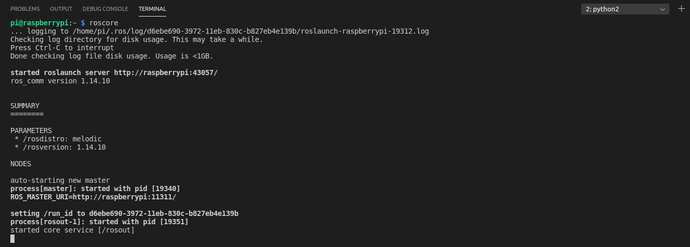
    </a>
</p>

Volvemos al primer terminal yendo al desplegable al lado del icono . Allí, **una vez asegurado que el robot no se irá al precipicio**, ejecutamos

```bash
rosrun hello_gopigo3 move_motors.py
```

*Et voilà!* Hemos hecho el mismo ejemplo, pero desde ROS.

### *Packages* de terceros

En un momento dado (básicamente, este), puede ser interesante hacer correr *packages* de terceros. Vamos a ver cómo añadir *packages* de terceros, pero antes veremos cómo reconoce/opera ROS con los *packages*.

ROS se puede instalar con una serie de *packages* por defecto. Normalmente, estos *packages* suelen ser muy utilizados y comunes por lo que es usual y recomendable instalarlos junto con ROS. Pero puede ser el caso que necesitemos otros *packages* que no tenemos instalados en nuestro sistema. Si ese el caso, tenemos dos opciones: 1) instalamos el *package* en nuestro sistema junto con ROS, o 2) añadimos ese *package* como uno más en nuestro *workspace* y lo compilamos con el resto.

Esta última opción suele ser la más común cuando se va a utilizar un *package* de manera puntual o pocas veces. También suele ser una opción muy útil a la hora de compartir proyectos puesto que envías el *workspace* junto con los *packages* necesarios.

ROS buscará los *packages* utilizados primeramente en nuestro *workspace* y, si no lo encuentra, después en su instalación. Por ello, si utilizamos un *package* que está tanto en nuestro *workspace* como en la instalación de ROS, ROS cogerá el *package* en nuestro *workspace*. Vamos a ver cómo añadir los tres *packages* que utilizaremos en estas sesiones.

#### *Package* gopigo3

Nos vamos a la carpeta `src`de nuestro *workspace* `hello_gopigo3`. Allí ejecutamos el comando

```bash
git clone https://github.com/ros-gopigo/gopigo3_node
```

El uso de Git da para un tema aparte y podréis verlo en detalle en la asignatura "[Microcontroladores para Aplicaciones y Sistemas Biomédicos (MASB)](http://grad.ub.edu/grad3/plae/AccesInformePDInfes?curs=2020&assig=366222&ens=TG1074&recurs=pladocent&n2=1&idioma=CAT)" del semestre que viene. Por el momento, os vale con saber que este comando copia un *package* de un repositorio remoto en vuestra carpeta `src`. Después de este comando, la estructura de nuestro *workspace* sería la siguiente

```
hello_gopigo3/
├── build
├── devel
└── src
    ├── gopigo3_node
    └── hello_gopigo3
```

Una vez añadido el *package*, nos vamos a la carpeta raíz del *workspace* y hacemos `catkin_make`. El comando `catkin_make` solo compila aquellos *packages* que se hayan modificado o añadido. No compilará otra vez el *package* `hello_gopigo3` que ya hemos compilado antes. Si no ha habido ningún error, hacemos

```bash
source devel/setup.sh
```

para indicar al terminal que hay disponible un nuevo *package*.

El *package* que acabamos de añadir permite controlar el robot y poder simular su modelo 3D. Primeramente, vamos a iniciar un nodo que esté suscrito a un *topic* donde indicaremos cómo mover el robot. En ese *topic* publicaremos a través de un segundo nodo. El diagrama de nuestro mapa de ROS sería el siguiente

<p align="center">
    <a href="../assets/imgs/rosgraph.svg">
      
    </a>
</p>

Primeramente, debemos ejecutar `roscore`. En principio, ya lo tenéis corriendo en un segundo terminal. Perfecto, porque en este segundo terminal canceláis el `roscore`. Para cancelar un proceso, lo hacemos con las teclas <kbd>CTRL</kbd>+<kbd>C</kbd>. Podéis cerrar este terminal.

"Pero... ¡¿si nos acabas de decir que debemos ejecutar `roscore`!?" Cierto. Pero el nodo del *package* gopigo3 lo ejecutaremos con el comando `roslaunch` que ya lanza `roscore` por detrás.

Seguidamente, vamos a iniciar el nodo que se encargará de mover el robot.

```bash
roslaunch gopigo3_node gopigo3.launch
```

<p align="center">
    <a href="../assets/imgs/roslaunch-gopigo3.png">
      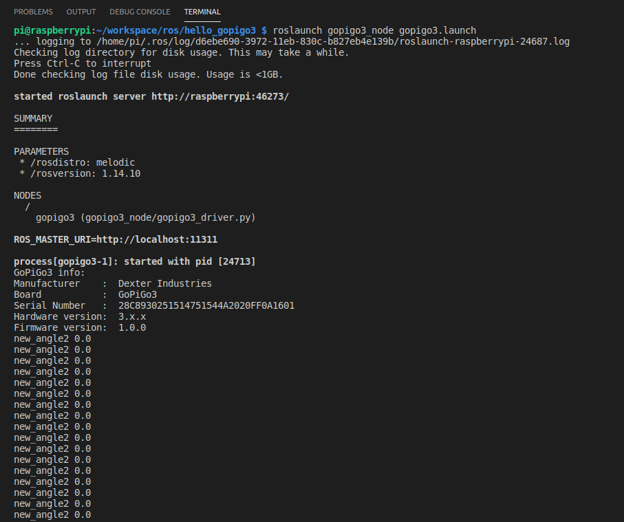
    </a>
</p>

¡Veréis que el terminal empieza a llenarse de datos! Eso es el ángulo de orientación del robot en función de lo que hayan girado las ruedas. En un segundo terminal, podéis ejecutar el comando

```bash
rostopic list
```

y veréis los topics en los que está publicando y está suscrito el nodo.

<p align="center">
    <a href="../assets/imgs/rostopic-list.png">
      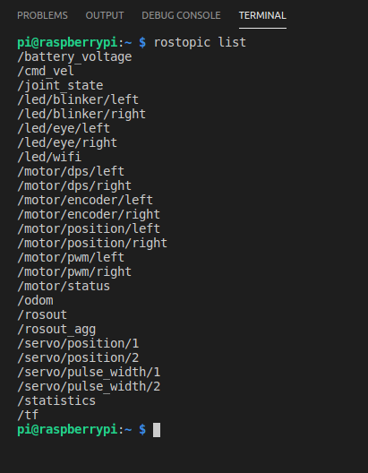
    </a>
</p>

Bien. Ahora tenemos el nodo que controla los motores del robot en marcha. Ahora vamos a iniciar un nodo que nos permitirá, mediante las flechas del teclado, mover el robot. Esto lo haremos en un nuevo terminal puesto que este está ocupado con el nodo que acabamos de lanzar.

#### *Package* teleop_tools

En el nuevo terminal, debemos ir a nuestro *workspace* de ROS y ejecutar el siguiente comando para descargar el *package* que contiene el nodo que nos permitirá controlar nuestro robot con las flechas del teclado. Acordaros de hacerlo dentro de la carpeta `src`.

```bash
git clone --single-branch --branch=kinetic-devel https://github.com/ros-teleop/teleop_tools.git
```

Ahora nuestra estructura de directorios es

```
hello_gopigo3/
├── build
├── devel
└── src
    ├── gopigo3_node
    ├── hello_gopigo3
    └── teleop_tools
```

Hacemos un `catkin_make` en la carpeta raíz de nuestro *workspace* y ejecutamos `source devel/setup.sh`. Una vez hecho, ejecutamos el siguiente comando

```bash
rosrun key_teleop key_teleop.py /key_vel:=/cmd_vel
```

Con `/key_vel:=/cmd_vel` lo que hacemos es [remapear los argumentos](http://wiki.ros.org/Remapping%20Arguments) del nodo para que publique en el *topic* `/cmd_vel` (que es al que está suscrito el nodo gopigo3) en lugar del *topic* original `/key_vel`.

**Antes de tocar nada y teniendo las pilas conectadas**, desconectamos el cable microUSB de la RPi y dejamos el robot en el suelo. **Asegúrate que las pilas están bien cogidas. No serías el primero que se les escurre el paquete de pilas del velcro y se desconecta la alimentación (ni serías el primero en suspender 💢💢)**. Seguidamente, pulsamos la flecha <kbd>↑</kbd> de nuestro teclado y ... ¡se mueveee!

<p align="center">
      
    </a>
</p>
Juega un poco con las flechas para mover el robot. Te mereces este momento de descanso 😭

Acabado el descanso, detén todos los procesos con <kbd>CTRL</kbd>+<kbd>C</kbd> y cierra todos los terminales hasta dejar solo uno para trabajar.

#### *Package* raspicam

Este *package*, que ahora mismo instalaremos, nos permitirá tomar capturas con la cámara de la RPi para, por ejemplo, realizar un procesado de imagen que nos permita reconocer personas o señales. Para instalar este *package*, vamos a la carpeta `src` de nuestro *workspace* y ejecutamos el siguiente comando

```bash
git clone https://github.com/UbiquityRobotics/raspicam_node.git
```

Una vez descargado, nos vamos al directorio raíz de nuestro *workspace* y hacemos un `catkin_make`.

Ui... ¿Errores? Vaya...

Nada que no se pueda solucionar. Vamos a ver el *output* de `catkin_make`. 

<p align="center">
    <a href="../assets/imgs/error-catkin-make.png">
      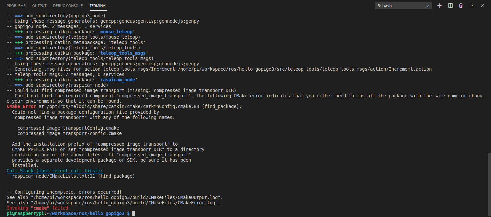
    </a>
</p>

Nos lo pone hasta en rojo... ¿Sabéis cuál es el error? Básicamente, el *package* raspicam depende de otro *package* llamado compressed_image_transport. Vamos a descargarlo en la carpeta `src`.

> Si alguien se pregunta cómo saber de dónde descargar los *packages*, tenemos dos grandes ayudantes: [Zipi](http://wiki.ros.org/) y [Zape](https://www.google.es/).

Ejecutamos el siguiente comando

```bash
git clone --single-branch --branch=indigo-devel https://github.com/ros-perception/image_transport_plugins.git
```

Si hiciésemos otro `catkin_make`, se nos diría que faltan otros *packages*. Los *packages* en cuestión son el cv_bridge y el image_transport. Los descargamos con

```bash
git clone --single-branch --branch=melodic https://github.com/ros-perception/vision_opencv.git
git clone --single-branch --branch=hydro-devel https://github.com/ros-perception/image_common.git
```

Ahora sí. Hacemos un `catkin_make` en el directorio raíz del *workspace* y no debería de darnos ningún error.

¿Lo probamos?

Pues no. Lo haremos más adelante (en la siguiente sección), puesto que tenemos que configurar nuestra VM para poder leer los *topics* que genera la RPi. ¿Porqué? ¡Porqué en RPi no tenemos un entorno gráfico donde ver las imágenes de la cámara!

#### *Package* ydlidar

El último *package* que instalaremos en esta sesión. Este *package* se encarga de operar el LIDAR y publicar sus medidas en un *topic*. Para instalarlo, ejecutamos el siguiente comando en la carpeta `src` de nuestro *workspace*

```bash
git clone https://github.com/EAIBOT/ydlidar.git
```

Este *package* no depende de ningún otro *package* que no tengamos ya disponible ya sea en la instalación de ROS o en nuestro *workspace*. Así pues, hacemos un `catkin_make`y no deberíamos obtener ningún error.

Con este *package* también podremos ver sus datos en Rviz en nuestra VM, pero también permite ver sus datos en el terminal; por lo que podemos probarlo ahora mismo. Para ello, hacemos previamente el pertinente `source devel/setup.sh` para indicar al terminal la presencia de este nuevo *package*. Seguidamente, conectamos mediante un cable USB, el conector USB_DATA de la PCB de control del LIDAR a un puerto USB de la RPi. También conectamos el otro conector USB de la PCB del LIDAR, llamado USB_PWR, a una fuente de alimentación externa como una *power bank* o un transformador adicional. Los puertos USB de la RPi no pueden ofrecer suficiente corriente al LIDAR para operar. De ahí que necesitemos una alimentación externa.

A continuación, necesitaremos obtener permisos para operar con el nuevo dispositivo USB, es decir, el LIDAR. Para ello, nos ponemos como usuarios propietarios del dispositivo. Los dispositivos aparecen como si fueran archivos dentro de la carpeta `/dev/`. Este dispositivo aparecerá como `/dev/ttyUSB*` siendo el asterisco un número. Para ponernos como usuario propietario, ejecutamos el comando

```bash
sudo chown pi:dialout /dev/ttyUSB*
```

Con el comando `chown` (`chown` = *change owner*) cambiamos tanto el usuario como el grupo. El grupo dejamos el que había, que es `dialout`. Volviendo donde estábamos, vamos a ejecutar el comando 

```bash
roscd ydlidar/startup
```

Este comando de ROS (`roscd`) nos lleva directamente al directorio del *package* indicado. En este directorio al que hemos ido, hay un script que nos configurará el dispositivo. Debemos de darle los permisos para poder ejecutarlo. Sabemos cómo hacerlo. El fabricante nos dice que demos permisos a todo el mundo para hacer todo (leer, escribir y ejecutar). No es una buena práctica, como hemos dicho antes... Pero si lo dice el fabricante... Le daremos un voto de confianza. Pero en un robot en aplicación real, vigilad bien a quién le dais permisos a hacer qué. Vamos a ello con el comando

```bash
sudo chmod a+rwx ./*
```

En este comando, la `a` significa "*all*" y `./*` significa "todos los archivos en el directorio `.`", donde el directorio `.` es el actual directorio. Es decir, el punto `.` es un carácter especial, como lo es la tilde `~ `, que significa "el directorio actual".

Ya podemos ejecutar el script de configuración.

```bash
sudo sh initenv.sh
```

Ya por último, con todo configurado, ejecutamos el nodo del LIDAR.

```bash
roslaunch ydlidar lidar.launch
```

Si todo ha funcionado correctamente, deberíamos de obtener el siguiente *output* en el terminal y el LIDAR debería de empezar a girar.

<p align="center">
    <a href="../assets/imgs/lidar.png">
      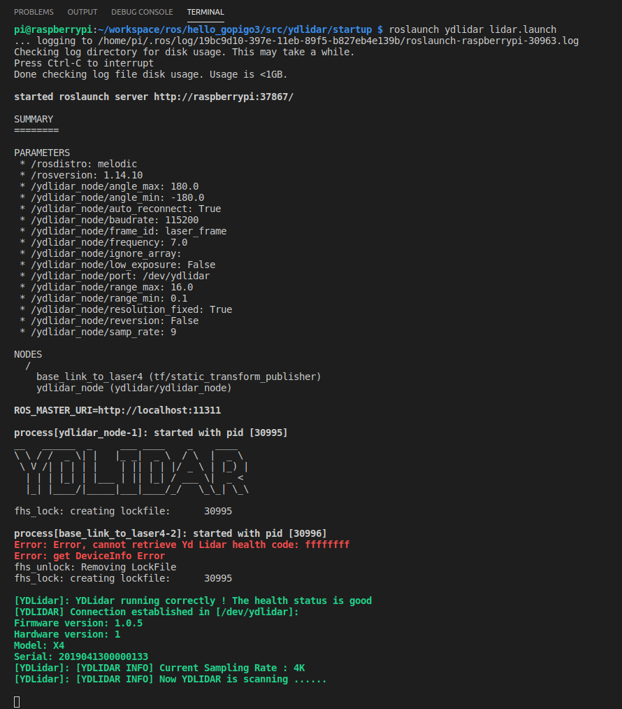
    </a>
</p>

Ya solo falta ver qué datos está publicando el nodo del LIDAR. Para ello, en un segundo terminal, ejecutamos el comando

```bash
rosrun ydlidar ydlidar_client
```

¿No os encuentra el comando? ¿Habéis hecho el `source devel/setup.sh` para que el terminal sepa que existe el *package* ydlidar? Este comando nos iniciará un nodo ROS que se suscribirá al *topic* publicado por el nodo del LIDAR y muestra los datos por el terminal.

<p align="center">
    <a href="../assets/imgs/datos-lidar.png">
      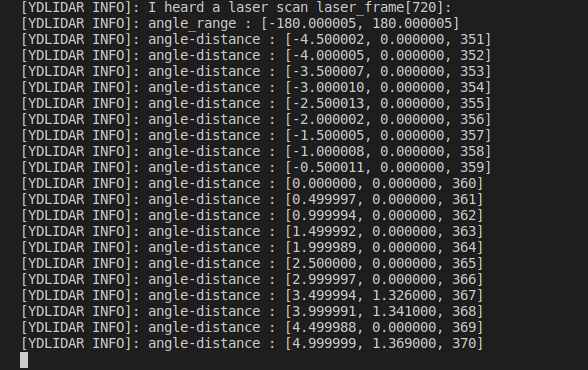
    </a>
</p>

Como se indica en el terminal, no muestra todos y cada uno de los puntos que mide. Solo unos cuántos. ¿Cuántos puntos? ¿Qué rango/ángulo corresponde con cada punto? Jugad tapando con la mano alrededor del LIDAR y observad como varían los valores al respecto.

Una vez entendido qué datos nos está dando el terminal, paramos todos los procesos (<kbd>CTRL</kbd>+<kbd>C</kbd>) y cerramos todos los terminales menos uno. Ahora vamos a ver esos datos gráficamente desde nuestra VM.

### Ver los datos en Rviz en nuestra VM

En un sistema ROS hay siempre un *master*. Un sistema que corre `roscore` y que gestiona todo la red ROS. En nuestro sistema, la RPi hace de *master*. Nuestra VM lo que hará es preguntarle a la RPi que *topics* hay disponibles y se suscribirá a ellos. Pero, ¿cómo sabe la VM dónde puede comunicarse con el *master*? Pues mediante la variable de entorno `ROS_MASTER_URI`. En esta variable almacenaremos la IP de nuestro *master* de tal modo que la VM sepa donde tiene que ir a buscar los *topics*.

Así pues, **abrimos un terminal en la VM**. Voy a repetirlo otra vez, por si acaso, **lo abrimos en la VM**. Es decir, vamos a Ubuntu y abrimos el terminal de Ubuntu, no el de VSC (que está conectado a la RPi). En ese recién abierto terminal, podemos configurar de dos modos la variable de entorno `ROS_MASTER_URI`

- Ejecutando el comando

  ```bash
  export ROS_MASTER_URI=http://XXX.XXX.XXX.XXX:11311
  ```

  Utilizando esta vía, deberemos de ejecutar este comando cada vez abramos un nuevo terminal.

- Ejecutando el comando

  ```bash
  echo 'export ROS_MASTER_URI=http://XXX.XXX.XXX.XXX:11311' >> ~/.bashrc 
  ```

  Este comando nos añadirá la exportación en nuestro archivo `.bashrc` y se ejecutará cada vez que abramos un terminal de manera automática.

Utilizaremos el segundo método puesto que la IP de la RPi no variará. Pero si lo hiciese, deberíamos de ir a nuestro archivo `.bashrc` en nuestro `home` y modificar allí la IP.

La IP `XXX.XXX.XXX.XXX` es la misma que habéis utilizado para conectaros a la RPi mediante SSH en VSC. El `:11311` adicional es el puerto a través del cual se hace la conexión. El puerto por defecto es 11311.

Una vez ejecutado el comando, o bien cerramos y abrimos el terminal para que se apliquen los cambios, o podemos ejecutar la instrucción

```bash
source ~/.bashrc
```

Hecho esto, nos vamos al terminal en RPi (es decir, en VSC) y ejecutamos los siguientes nodos en diferentes terminales. Acuérdate de hacer un `source devel/setup.sh` en cada uno de los terminales. En el primer terminal ejecutamos

```bash
cd ~/workspace/ros/hello_gopigo3
source devel/setup.sh
roslaunch ydlidar lidar.launch
```

En un segundo terminal, ejecutamos

```bash
cd ~/workspace/ros/hello_gopigo3
source devel/setup.sh
roslaunch raspicam_node camerav2_1280x960_10fps.launch enable_raw:=true camera_frame_id:="laser_frame"
```

Hemos añadido unos parámetros de lanzamiento. Ignoradlos por el momento.

En la RPi ya tenemos todo lanzado. Tanto el LIDAR como la cámara. Volvemos al terminal de la VM (Ubuntu).

Allí, ejecutamos el comando `Rviz` para abrir Rviz. Si al ejecutar el comando os dice que no encuentra el *master*, es porque no habéis indicado correctamente la IP en la variable `ROS_MASTER_URI` o porque no habéis iniciado los nodos ROS en la RPi. Si todo sigue su curso correctamente, se os abrirá Rviz.

Lo primero que haremos en Rviz es configurar el `Fixed Frame`en las `Global Options` en el navegador en la zona izquierda de la aplicación. Allí escribiremos `laser_frame`.

A continuación, añadiremos la cámara. Para ello, clicamos sobre el botón `Add` debajo del panel de navegación de la izquierda. En la ventana emergente, nos vamos a la pestaña `By topic` y hacemos doble clic sobre `Camera` dentro de `/raspicam_node/image` asegurándonos que está seleccionado `RAW`en el desplegable del lado. Justo debajo del botón `Add`que acabamos de pulsar, nos debería de aparecer las imágenes recogidas por la cámara.

Para ver los datos del LIDAR, seguimos el mismo procedimiento. Pulsamos sobre el botón `Add` y nos vamos a la pestaña `By topic`. Allí hacemos doble clic sobre `LaserScan` dentro de `/scan`. Ahora deberíamos de poder ver, como puntos rojos, los puntos reconocidos en el espacio por el LIDAR.

Para saber donde se encuentra el robot, añadiremos un sistema de referencia o *axes*. Nos vamos al botón `Add` y esta vez, en la pestaña `By display type`, hacemos doble clic sobre `Axes`. Se nos añadirá un sistema de coordenadas gigante justo done está el robot. Podemos hacerlo más pequeño desde el panel de navegación de la izquierda, fijando un `Lenght`de 0.1 y un `Radius`de 0.01 en las propiedades del `Axes`.

Esta sería la pinta de nuestro Rviz mostrando todos los datos recogidos por el robot.

<p align="center">
    <a href="../assets/imgs/rviz.png">
      
    </a>
</p>

Hecho esto, ya hemos acabado. Simplemente, cerramos Rviz y paramos todos los nodos en la RPi.

### Apagar lar RPi

Igual de importante que el resto de los pasos anteriores es apagar la RPi de manera correcta. Para ello, en un terminal conectado a la RPi (es decir, desde VSC) ejecutamos el comando

```bash
sudo shutdown now
```

Con esto apagamos la RPi. Cuando el LED amarillo de la RPi deje de parpadear, podemos quitar todas las alimentaciones sin miedo.

## Reto

En esta sesión no hay más reto que hacer el esfuerzo de entender todo lo que se ha hecho. Es una primera sesión muy cañera porque vamos desde ver cosas tan básicas como crear una carpeta o cambiar de directorio, hasta como visualizar en remoto datos obtenidos por el robot mediante ROS. Así que ese es el reto.

## Evaluación

## Conclusiones
