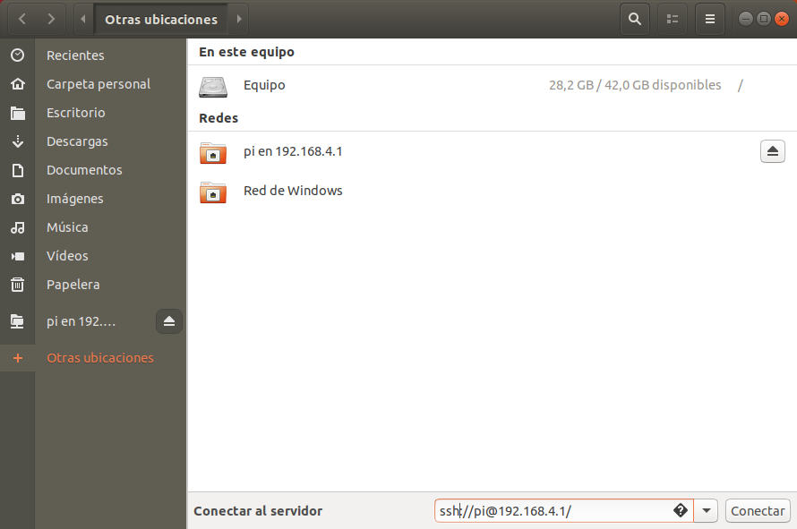
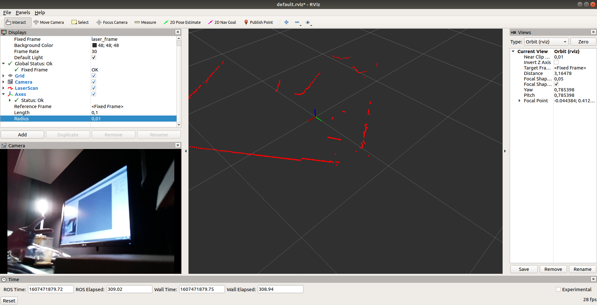

# Evitar obstáculos de manera autónoma

<blockquote><a rel="cc:attributionURL" property="dct:title" href="https://github.com/Albert-Alvarez/ros-con-gopigo3">Evitar obstáculos de manera autónoma</a> por <a rel="cc:attributionURL dct:creator" property="cc:attributionName" href="https://thealbert.dev/">Albert Álvarez Carulla</a> se distribuye bajo una <a rel="license" href="https://creativecommons.org/licenses/by-nd/4.0/deed.es">Licencia Creative Commons Atribución-SinDerivadas 4.0 Internacional (CC BY-ND 4.0)</a>.<br /></a></blockquote>

## Contenidos

- [Objetivos](#objetivos)
- [Procedimiento](#procedimiento)

## Objetivos

- Ver y comprender un *launch file*.
- Aprender a utilizar argumentos al lanzar *launch files*.
- Ver y comprender un algoritmo para evitar obstáculos de manera autónoma.

## Procedimiento

> **IMPORTANTE:** Cualquier **duda** o problema durante esta sesión (¡o cualquier cosa que haya que corregir en el guión!), **cread un *issue* en el siguiente [enlace](https://github.com/Albert-Alvarez/ros-con-gopigo3/issues)**. Deberéis de **crearos un usuario en [GitHub](https://github.com/)** [](../assets/imgs/its_free.jpg) La idea es que todo quede centralizado aquí y futuros estudiantes encuentren aquí las dudas y soluciones que han tenido compañeros de cursos anteriores. Esto no se puede hacer en Moodle tal y como está configurado ahora mismo puesto que los mensajes del Foro no sobreviven de un año para el otro 😥

### Preparación del *workspace*

> Como en la sesión anterior, estáis compartiendo el robot con otros compañeros. En este guión se os indica y se os dan los comandos para trabajar en una carpeta llamada `workspace`. Para evitar solaparos, **crearos cada uno vuestra propia carpeta `workspace`** (por ejemplo, `workspace1`, `workspace2`, `workspace3`, etc.) y **sustituir de manera conveniente en los comandos a utilizar**.

En la sesión anterior ya vimos las operaciones básicas en ROS con el GoPiGo3, por lo que en esta sesión vamos a ver un ejemplo de *workspace* ya implementado en el que se llevará a cabo un **algoritmo para evitar obstáculos**. Como veremos, el algoritmo consiste en **ir en línea recta** hasta que con el **LIDAR se detecta** que se va a chocar con algún **obstáculo**. Cuando esto ocurre, el **robot tirará marcha atrás a la vez que gira** y, una vez esquivado el obstáculo, seguirá su marcha. Este *workspace* os ha de servir como guía/ejemplo/"pista" para el proyecto que haréis en ROS en simulación.

Otra cosa que también vimos es a mi batallando con el WiFi.

<p align="center">
	
</p>

Como vimos, en sistemas distribuidos, la calidad de la conexión es vital y esa calidad no se daba. Por ello, cambiaremos la estructura de nuestra red. En la anterior sesión conectábamos nuestras RPi y nuestros ordenadores a un router. El router se encargaba de gestionar la transmisión de los paquetes de datos entre los dispositivos. En la nueva estructura de red que utilizaremos en esta sesión, cada **RPi actuará como *host access point*** y **generará una red WiFi.** Nos conectaremos a la WiFi de nuestro robot y nos intercambiaremos paquetes de datos directamente con él. Eliminando el intermediario que tantos quebraderos de cabeza nos dio (el router), lograremos mejorar el desempeño de la comunicación inalámbrica.

Ventajas:

- Nos ahorramos el router, que puede ocasionar problemas.
- La IP del robot ya la sabemos de antemano. No hace falta que le preguntemos al profesor. La IP de la RPi será `192.168.4.1`.

Desventajas:

- No tendremos internet. Puesto que la RPi ocupa su controlador de red a generar una red WiFi, no puede conectarse a otra WiFi. Y como nuestro ordenador está directamente conectado a la RPi, no puede conectarse a otra WiFi y no tendrá internet. Pero tranquil@s. No lo necesitamos.

El uso de esta nueva estructura de red implica unas ligeras diferencias a la hora de entrar a la RPi mediante SSH. Básicamente, no podemos utilizar VSC como hasta ahora. Pero utilizaremos otro método que, me atrevo a decir, puede que os guste más o os resulte más cómodo. Lo veremos a continuación.

Bien. Pues empecemos. Primeramente, **nos conectamos a la red WiFi generada por nuestro robot** (aseguraos que está encendido... 😒). El **SSID de la red será "RoboticsUB_XXXX"** donde los cuatro últimos dígitos corresponden a los últimos cuatro dígitos de la dirección MAC de la RPi (un identificador único). **En el robot encontraréis escrito esos cuatro dígitos.** La **contraseña** es la de siempre: "CorrePiCorre".

Seguidamente, una vez conectados, **modificaremos la configuración de red de nuestra VM**. Vamos a VirtualBox, a los parámetros de Red de nuestra VM y allí, en el desplegable, seleccionamos **"Adaptador puente"** (muy seguramente, antes teníamos configurado "NAT"). Clicamos `Aceptar` y, si teníamos encendida/arrancada la VM, la **reinciamos**.

Ahora nos conectaremos a la RPi (sin VSC). Lo haremos fácil. Abrimos en nuestra VM la aplicación **Archivos** (básicamente, el explorador de archivos de Ubuntu) y clicamos sobre "Otras ubicaciones" en la barra lateral izquierda. Ahora, en la barra inferior de la ventana, donde se indica **"Conectar al servidor"**, escribimos:

```
ssh://pi@192.168.4.1/
```

<p align="center">
	<a href="../assets/imgs/conexion-remota-archivos.png">
		
  </a>
</p>

Pulsamos en `Conectar` y *et voilà*. Se nos abrirá una **carpeta con acceso a todos los archivos de la RPi**. También se nos creará un **acceso en el Escritorio**. Navegaremos por esa carpeta normalmente tal y como lo haríamos por cualquier otra.

Tenemos acceso a los archivos. ¿Y el **terminal**? *Easy*. Haciendo **clic derecho al acceso a la RPi que se nos ha creado en el Escritorio** nos da la opción de abrir un **terminal en el sistema remoto**. Nos pedirá la contraseña y ya tenemos nuestro terminal dentro de la RPi.

Bien. Teniendo ya acceso a los archivos de la RPi y a un terminal dentro de ella, podemos empezar 😉

Dentro de la RPi, ejecutaremos estos comandos.

```bash
mkdir -p ~/workspace/ros/session2/src
cd ~/workspace/ros/session2/src
cp -R ~/ros_packages/gopigo3_node .
cp -R ~/ros_packages/obstacle_avoidance .
cp -R ~/ros_packages/ydlidar .
```

Con estos comandos hemos creado nuestra carpeta de *workspace* y hemos entrado. Luego, hemos añadido los *packages* que necesitaremos. Antes hacíamos `git clone` para coger los repositorios desde internet, pero "oh, sorpresa" no tenemos internet. Entonces lo que hemos hecho es dejaros preparados los *packages* que necesitaremos en la carpeta `~/ros_packages` y de allí nos los copiamos a nuestro *workspace*.

Con todo esto, si chafardeáis vuestro *workspace*, veréis que ya tenemos una serie de *packages*. Básicamente, son todos los que utilizaremos en esta sesión: gopigo3_node, ydlidar_node y obstacle_avoidance. Los dos primeros ya los conocemos y el último es un *package* desarrollado expresamente para esta sesión. Deberíamos lanzar los tres en terminales distintos y, además, utilizar un cuarto terminal para correr `roscore`. Un auténtico palo... Creo que va siendo hora de ver la comodidad de los *launch files*.

### Los *launch files*

En la carpeta `~/workspace/ros/session2/src/obstacle_avoidance/launch` hay un archivo llamado `obstacle_avoidance_node.launch`. Ábrelo. La pinta que tiene es la siguiente.

```xml
<launch>

    <node name="gopigo3" pkg="gopigo3_node" type="gopigo3_driver.py" />

    <node name="ydlidar_node" pkg="ydlidar" type="ydlidar_node" respawn="false" >
        <param name="port" type="string" value="/dev/ydlidar"/>
        <param name="baudrate" type="int" value="115200"/>
        <param name="frame_id" type="string" value="base_scan"/>
        <param name="low_exposure" type="bool" value="false"/>
        <param name="resolution_fixed" type="bool" value="true"/>
        <param name="auto_reconnect" type="bool" value="true"/>
        <param name="reversion" type="bool" value="false"/>
        <param name="angle_min" type="double" value="-180" />
        <param name="angle_max" type="double" value="180" />
        <param name="range_min" type="double" value="0.1" />
        <param name="range_max" type="double" value="16.0" />
        <param name="ignore_array" type="string" value="" />
        <param name="samp_rate" type="int" value="9"/>
        <param name="frequency" type="double" value="7"/>
    </node>
    
    <node pkg="tf" type="static_transform_publisher" name="base_link_to_base_scan"
        args="-0.03 0.01 0.15 3.1416  0.0 0.0   /base_link /base_scan 40" />

    <arg name="distance_laser" default="0.3" />
    <arg name="speed_factor" default="0.3" />
    <arg name="forward_speed" default="3.8" />
    <arg name="backward_speed" default="-1.5" />
    <arg name="rotation_speed" default="1.5" />
    <node name="obstacle_avoidance" pkg="obstacle_avoidance" type="obstacle_avoidance_node.py" output="screen" >
        <param name="distance_laser" value="$(arg distance_laser)"/>
        <param name="speed_factor" value="$(arg speed_factor)"/>
        <param name="forward_speed" value="$(arg forward_speed)"/>
        <param name="backward_speed" value="$(arg backward_speed)"/>
        <param name="rotation_speed" value="$(arg rotation_speed)"/>
    </node>    

</launch>
```

Básicamente, es un archivo en formato [XML](https://es.wikipedia.org/wiki/Extensible_Markup_Language) que permite lanzar múltiples nodos a la vez y, simultáneamente, lanzar `roscore`. Útil, ¿verdad? En el archivo podemos ver como primeramente se lanza el nodo `gopigo3_driver.py`. Seguidamente, se lanza los nodos `ydlidar_node` y `static_transform_publisher`. Estos dos van de la mano, lo que pasa que antes nos quedaba enmascarado el nodo `static_transform_publisher` debajo del *launch file* que utilizábamos para arrancar el LIDAR. Por último, está el nodo `obstacle_avoidance_node.py` que se encarga de evitar los obstáculos.

En este último nodo, hemos configurado argumentos/parámetros para que, en el caso de así quererlo, poder modificar algunos parámetros del nodo durante el lanzamiento, como la velocidad o el límite de distancia a partir del cual el robot gira hacia otro lado. Si no indicamos nada, se configuraran los valores por defecto.

Para lanzar este archivo, haríamos (**"haríamos"**, aún no lo hacemos):

```bash
roslaunch obstacle_avoidance obstacle_avoidance_node.launch
```

Con este comando, el *launch file* se ejecutaría con los parámetros por defecto. Si por ejemplo queremos variar la distancia límite, haríamos:

```bash
roslaunch obstacle_avoidance obstacle_avoidance_node.launch distance_laser:=0.2
```

Si quisiéramos variar además el factor de velocidad (que incrementa proporcionalmente todas las velocidades configurables del robot), haríamos:

```bash
roslaunch obstacle_avoidance obstacle_avoidance_node.launch distance_laser:=0.2 speed_factor:=1.3
```

Y así sucesivamente.

Ahora vamos a ver qué hace este nodo `obstacle_avoidance_node.py`.

### Nodo de control autónomo

Este nodo lo encontramos en la carpeta `~/workspace/ros/session2/src/obstacle_avoidance/scripts` con el nombre `obstacle_avoidance_node.py`. Previamente a abrirlo, para que no se nos olvide, vamos a darle permisos de ejecución para que nos dejen correr el nodo una vez hagamos el pertinente `catkin_make` y `source develop/setup.sh`. Esto lo hacemos con el siguiente comando:

```bash
sudo chmod -R +x ~/workspace/ros/session2/src/*
```

> Si os fijáis, en esta sesión los comandos son un pelín más largos que en la sesión anterior porque os estoy indicando los comandos utilizando rutas absolutas. De este modo, los comandos funcionaran indistintamente de la carpeta desde donde los ejecutéis.

Hecho esto, abrimos el archivo. Tendrá una pinta como la siguiente (como la otra vez, os comento en el propio código el funcionamiento):

```python
#!/usr/bin/env python

# Importamos librerias.
import rospy
import sys
from sensor_msgs.msg import LaserScan
from geometry_msgs.msg import Twist

# Creamos una clase para hacer el codigo mas legible.
# Ademas, se suele utilizar la programacion orientada a objetos (OOP) para
# facilitar el test unitario del codigo. Por si teneis curiosidad y quereis
# buscar mas info.
class GoPiGo3:

    # Este metodo se ejecuta una vez se crea un objeto de esta clase.
    def __init__(self):

        # Inicializamos el nodo con el nombre 'obstacle_avoidance'.
        rospy.init_node("obstacle_avoidance", anonymous=False)

        # Leemos los parametros que nos hayan podido pasar desde el launch file.
        self._distanceLaser = rospy.get_param("~distance_laser")
        self._speedFactor = rospy.get_param("~speed_factor")
        self._forwardSpeed = rospy.get_param("~forward_speed")
        self._backwardSpeed = rospy.get_param("~backward_speed")
        self._rotationSpeed = rospy.get_param("~rotation_speed")

        # Configuramos las variables internas relacionadas con el funcionamiento de ROS.
        # Mensaje que enviaremos.
        self._msg = Twist()
        # Topic en el que publicaremos
        self._cmdVel = rospy.Publisher("/cmd_vel", Twist, queue_size=10)
        # Topic en el que nos suscribiremos y funcion que utilizaremos al recibir mensajes.
        rospy.Subscriber("/scan", LaserScan, self.callbackLaser) 
        # Funcion que ejecutaremos al apagar el nodo (cerrarlo, CTRL + C).
        rospy.on_shutdown(self.shutdown)

        # Frecuencia con la que se publicaran mensajes en el topic.
        self._r = rospy.Rate(5)

    # Este metodo inicia la operacion del nodo.
    def start(self):
	   	# Publicamos mientras el nodo no este apagado.
        while not rospy.is_shutdown():
            self._cmdVel.publish(self._msg)
            self._r.sleep()

    # Funcion que se ejecutara cada vez que obtengamos un mensaje del LIDAR.
    def callbackLaser(self, scan):

        # De los 720 puntos que nos envia, miramos cual es el que esta mas cerca,
        # a que distancia y que angulo.
        closestDistance, elementIndex = min(
            (val, idx) for (idx, val) in enumerate(scan.ranges)
            if scan.range_min < val < scan.range_max
        )

        angleClosestDistance = self.__wrapAngle(elementIndex / 2)

        # Damos informacion al usuario.
        rospy.loginfo("Closest distance of %5.2f m at %5.1f degrees.",
                      closestDistance, angleClosestDistance)

        # Si la distancia es menor que la configurada por el usuario y este elemento
        # tan cercano esta enfrente, tiramos marcha atras y giramos hacia el otro
        # lado.
        if closestDistance < self._distanceLaser and -90 < angleClosestDistance < 90:

            self._msg.linear.x = self._backwardSpeed * self._speedFactor
            self._msg.angular.z = -self.__sign(
                angleClosestDistance) * self._rotationSpeed * self._speedFactor

            rospy.logwarn(
                "Within laser distance threshold. Rotating the robot (z=%4.1f)...", self._msg.angular.z)
		
        # Por el contrario, seguimos rectos.
        else:

            self._msg.linear.x = self._forwardSpeed * self._speedFactor
            self._msg.angular.z = 0

    # Funcion privada para obtener el signo de un numero.
    def __sign(self, val):

        if val >= 0:
            return 1
        else:
            return -1

    # Funcion privada para hacer que un angulo de 0 a 360 grado pase a un angulo de 
    # -180 a 180 grados.
    def __wrapAngle(self, angle):

        if 0 <= angle <= 180:
            return angle
        else:
            return angle - 360

    # Funcion que se ejecuta al apagarse el nodo. Configuramos todas las velocidades a 0
    # y paramos el robot.
    def shutdown(self):

        self._msg.linear.x = 0
        self._msg.angular.z = 0
        self._cmdVel.publish(self._msg)

# Hacemos este IF para asegurarnos que este archivo se ejecuta si se le llama a directamente,
# y no porque ha sido importado en otro archivo python.
if __name__ == '__main__':
    try:
		# Creamos un objeto de la clase GoPiGo().
        gpg = GoPiGo3()
	
    	# Iniciamos la operacion del nodo.
        gpg.start()
        rospy.spin()

    except rospy.ROSInterruptException: pass
```

Visto el código, vamos a ver si funciona. Primeramente, hacemos el pertinente `catkin_make` en la carpeta raiz de nuestro *workspace*, hacemos un `source devel/setup.sh`, conectamos todas las conexiones del robot (alimentación y cables microUSB del LIDAR), ejecutamos los comandos para poder acceder al LIDAR (chuleta a continuación) y lanzamos el *launch file* que hemos visto anteriormente. El conexionado del robot no os lo puedo automatizar... 😑 Tampoco el que reviséis que el robot está en el suelo. El resto sí os lo puedo pasar y aquí os lo dejo:

```bash
cd ~/workspace/ros/session2
catkin_make
source devel/setup.sh
sudo chown pi:dialout /dev/ttyUSB*
roscd ydlidar/startup
sudo chmod a+rwx ./*
sudo sh initenv.sh
roslaunch obstacle_avoidance obstacle_avoidance_node.launch
```

Ejecutado esto, si no ha habido ningún error, vuestro robot empezará a avanzar hasta encontrar un obstáculo y girar para evitarlo. ¡Genial!

Podéis jugar con los parámetros del *launch file* para hacer que vaya más rápido o que la distancia límite sea más grande o pequeña. Ponedle obstáculos delante a ver qué tal. Cuando queráis cambiar un parámetro, presionad <kbd>CTRL</kbd>+<kbd>C</kbd> para detener todos los procesos y ejecutad el *launch file* otra vez con los nuevos parámetros. No hace falta hacer un `catkin_make` para cambiar los parámetros de un *launch file*.

¿Cómo evaluáis el desempeño del algoritmo? ¿Funciona correctamente? ¿Puede gestionar cualquier tipo de situación o obstáculo? Jugad con el código python para mirar de mejorar el algoritmo y acabar de ver cómo funciona este *package* 😉

### Visualizar los datos en Rviz en la VM

Rescatemos este procedimiento de la sesión 1 que no nos dio tiempo a acabar (es lo que nos faltaba por hacer).

En un sistema ROS hay siempre un *master*. Un sistema que corre `roscore` y que gestiona todo la red ROS. En nuestro sistema, la RPi hace de *master*. Nuestra VM lo que hará es preguntarle a la RPi que *topics* hay disponibles y se suscribirá a ellos. Pero, ¿cómo sabe la VM dónde puede comunicarse con el *master*? Pues mediante la variable de entorno `ROS_MASTER_URI`. En esta variable almacenaremos la IP de nuestro *master* de tal modo que la VM sepa donde tiene que ir a buscar los *topics*.

Así pues, **abrimos un terminal en la VM**. Voy a repetirlo otra vez, por si acaso, **lo abrimos en la VM**. Es decir, vamos a Ubuntu y abrimos el terminal de Ubuntu, no el que está conectado a la RPi. En ese recién abierto terminal, podemos configurar de dos modos la variable de entorno `ROS_MASTER_URI`

- Ejecutando el comando

  ```bash
  export ROS_MASTER_URI=http://192.168.4.1:11311
  ```

  Utilizando esta vía, deberemos de ejecutar este comando cada vez abramos un nuevo terminal.

- Ejecutando el comando

  ```bash
  echo 'export ROS_MASTER_URI=http://192.168.4.1:11311' >> ~/.bashrc 
  ```

  Este comando nos añadirá la exportación en nuestro archivo `.bashrc` y se ejecutará cada vez que abramos un terminal de manera automática.

Utilizaremos el segundo método puesto que la IP de la RPi no variará. Pero si lo hiciese, deberíamos de ir a nuestro archivo `.bashrc` en nuestro `home` y modificar allí la IP.

La IP `192.168.4.1` es la misma que habéis utilizado para conectaros a la RPi mediante SSH en VSC. El `:11311` adicional es el puerto a través del cual se hace la conexión. El puerto por defecto es 11311.

Una vez ejecutado el comando, o bien cerramos y abrimos el terminal para que se apliquen los cambios, o podemos ejecutar la instrucción

```bash
source ~/.bashrc
```

Hecho esto, debemos de configurar una segunda variable. Esta es `ROS_IP`.  Esta variable almacenará la IP de la VM y será la que entreguemos al master (la RPi) para que sepa dónde enviar los paquetes. La IP de nuestra VM la podemos obtener mediante el comando

```bash
hostname -I
```

Utilizamos el mismo procedimiento que con `ROS_MASTER_URI` para guardar la variable `ROS_IP`. 

Ahora, ejecutamos el comando `Rviz` para abrir Rviz. Si al ejecutar el comando os dice que no encuentra el *master*, es porque no habéis indicado correctamente la IP en la variable `ROS_MASTER_URI` o porque no habéis iniciado los nodos ROS en la RPi. Si todo sigue su curso correctamente, se os abrirá Rviz.

Para ver los datos del LIDAR, pulsamos sobre el botón `Add` y nos vamos a la pestaña `By topic`. Allí hacemos doble clic sobre `LaserScan` dentro de `/scan`. Luego configuraremos el `Fixed Frame`en las `Global Options` en el navegador en la zona izquierda de la aplicación. Allí escribiremos `base_scan`. Ahora deberíamos de poder ver, como puntos rojos, los puntos reconocidos en el espacio por el LIDAR.

Para saber dónde se encuentra el robot, añadiremos un sistema de referencia o *axes*. Nos vamos al botón `Add` y esta vez, en la pestaña `By display type`, hacemos doble clic sobre `Axes`. Se nos añadirá un sistema de coordenadas gigante justo done está el robot. Podemos hacerlo más pequeño desde el panel de navegación de la izquierda, fijando un `Lenght`de 0.1 y un `Radius`de 0.01 en las propiedades del `Axes`.

Esta sería la pinta de nuestro Rviz mostrando todos los datos recogidos por el robot (falta la cámara que, si nos da tiempo, os enseño en la clase mismo cómo añadirla 😉).

<p align="center">
    <a href="../assets/imgs/rviz.png">
      
    </a>
</p>


Hecho esto, ya hemos acabado. Simplemente, cerramos Rviz y paramos todos los nodos en la RPi.

### Apagar lar RPi

Igual de importante que el resto de los pasos anteriores es apagar la RPi de manera correcta. Para ello, en un terminal conectado a la RPi ejecutamos el comando

```bash
sudo shutdown now
```

Con esto apagamos la RPi. Cuando el LED amarillo de la RPi deje de parpadear, podemos quitar todas las alimentaciones sin miedo.
